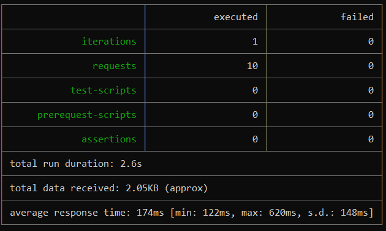
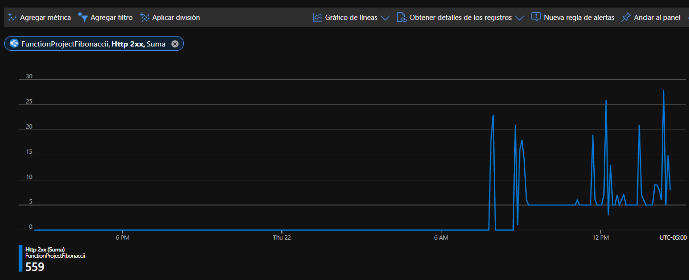
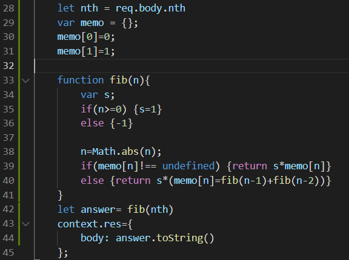
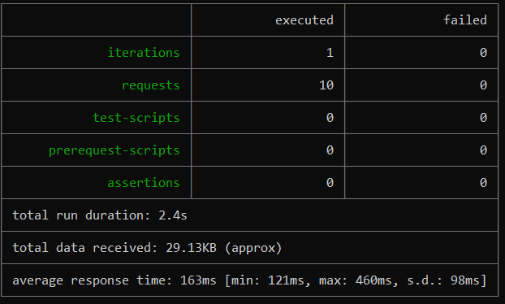

### Escuela Colombiana de Ingeniería
### Arquitecturas de Software - ARSW

## Escalamiento en Azure con Maquinas Virtuales, Sacale Sets y Service Plans

### Dependencias
* Cree una cuenta gratuita dentro de Azure. Para hacerlo puede guiarse de esta [documentación](https://azure.microsoft.com/en-us/free/search/?&ef_id=Cj0KCQiA2ITuBRDkARIsAMK9Q7MuvuTqIfK15LWfaM7bLL_QsBbC5XhJJezUbcfx-qAnfPjH568chTMaAkAsEALw_wcB:G:s&OCID=AID2000068_SEM_alOkB9ZE&MarinID=alOkB9ZE_368060503322_%2Bazure_b_c__79187603991_kwd-23159435208&lnkd=Google_Azure_Brand&dclid=CjgKEAiA2ITuBRDchty8lqPlzS4SJAC3x4k1mAxU7XNhWdOSESfffUnMNjLWcAIuikQnj3C4U8xRG_D_BwE). Al hacerlo usted contará con $200 USD para gastar durante 1 mes.

### Parte 0 - Entendiendo el escenario de calidad

Adjunto a este laboratorio usted podrá encontrar una aplicación totalmente desarrollada que tiene como objetivo calcular el enésimo valor de la secuencia de Fibonnaci.

**Escalabilidad**
Cuando un conjunto de usuarios consulta un enésimo número (superior a 1000000) de la secuencia de Fibonacci de forma concurrente y el sistema se encuentra bajo condiciones normales de operación, todas las peticiones deben ser respondidas y el consumo de CPU del sistema no puede superar el 70%.

### Escalabilidad Serverless (Functions)

1. Cree una Function App tal cual como se muestra en las  imagenes.

2. Instale la extensión de **Azure Functions** para Visual Studio Code.

3. Despliegue la Function de Fibonacci a Azure usando Visual Studio Code. La primera vez que lo haga se le va a pedir autenticarse, siga las instrucciones.

4. Dirijase al portal de Azure y pruebe la function.

5. Modifique la coleción de POSTMAN con NEWMAN de tal forma que pueda enviar 10 peticiones concurrentes. Verifique los resultados y presente un informe.

6. Cree una nueva Function que resuleva el problema de Fibonacci pero esta vez utilice un enfoque recursivo con memoization. Pruebe la función varias veces, después no haga nada por al menos 5 minutos. Pruebe la función de nuevo con los valores anteriores. ¿Cuál es el comportamiento?.

- Se puede notar como claramente como las request fueron respondidas con un OK, con diferencias de tiempos al cambiar Fibonacci a un enfoque recursivo con memorización

**Preguntas**

* ¿Qué es un Azure Function?

`Cuando hablamos de un Azure Function nos referimos a un servicio en la nube que dispone de multiples aplicaciones,así mismo este servicio tambien es responsable de tener todos los recursos que se necesitan para estas aplicaciones con un debido mantenimiento y actualizados. Entre sus usos mas populares se pueden destacar las funciones que ofrece para crear distintas aplicaciones Web y tambien para las transacciones que puedan haber en distintas bases de datos.`

* ¿Qué es serverless?

`Es un modelo de ejecución en el que el proveedor en la nube (AWS, Azure o Google Cloud) es responsable de ejecutar un fragmento de código mediante la asignación dinámica de los recursos. Y cobrando solo por la cantidad de recursos utilizados para ejecutar el código. El código, generalmente, se ejecuta dentro de contenedores sin estado que pueden ser activados por una variedad de eventos que incluyen solicitudes HTTP, eventos de base de datos, servicios de colas, alertas de monitoreo, carga de archivos, eventos programados (trabajos cron), etc. El código que se envía a al proveedor en la nube para la ejecución es generalmente en forma de una función. Por lo tanto, serverless a veces se denomina “Funciones como servicio” o “FaaS”.`

* ¿Qué es el runtime y que implica seleccionarlo al momento de crear el Function App?

`Un runtime se puede definir masomenos como un pequeño sistema operativo y proporcionan toda la funcionalidad que los programas necesitan para ejecutarse. Esto incluye desde interfaces hasta elementos físicos de hardware, pasando por interacciones del usuario y componentes de software.
El runtime environment carga todas las aplicaciones de un programa y las ejecuta en una plataforma,esta plataforma pone a disposición todos los recursos necesarios para ejecutar el programa independientemente del sistema operativo. En Azure se tiene disponibilidad de .NET, Nodejs, Pyhton y Java. 
Las implicaciones trae seleccionarlo  es que dependiendo el plan y la version del runtime se vera afectado el tiempo de timeout y el intervalo de limpieza del cache en memoria.`

* ¿Por qué es necesario crear un Storage Account de la mano de un Function App?

`Debido a las operaciones de almacenamiento y administracion que realizan las Function App.`

* ¿Cuáles son los tipos de planes para un Function App?, ¿En qué se diferencias?, mencione ventajas y desventajas de cada uno de ellos.

Los dos planes que son el Consumption y el Premium plan:

`Consumption: El plan de consumo de Azure Functions factura en función del consumo de recursos y las ejecuciones que se hace por cada segundo, este plan viene con una concesión mensual de 1.000.000 de solicitudes y 400.000 Gbs de consumo de recursos por mes y por suscripción en el precio de pago por uso en todas las aplicaciones de funciones de esa suscripción. `

`Premium plan: El plan Premium ofrece básicamente las mismas funciones y el mismo mecanismo de escalado que usa el plan Consumption sin arranque en frio. Este plan a diferencia del consumption cuenta con un rendimiento mucho mejor y adicionalmente acceso a VNET. Este plan  factura por segundo en función del numero de vCPUs y Gbs que consuman sus funciones Premium. `

* ¿Por qué la memorization falla o no funciona de forma correcta?

`Puede ocurrir por diversos factores, entre estos esta la magnitud de los números que se generan a la hora de hacer una petición, otro factor podría ser que debido a que los números de las peticiones son muy grandes se podría exceder el limite que tiene de recursiones y por ultimo también entra en juego el tipo de plan que se eligió, ya que es el Consumption el stack de la memoria puede estarse llenando muy rápidamente y esto produce que la memorización que se hace no pueda funcionar correctamente.`
* ¿Cómo funciona el sistema de facturación de las Function App?

`Se factura en función del consumo de recursos y las ejecuciones por segundo como se dijo en puntos anteriores.`
* Informe

`Como se puede observar, las peticiones terminaron al correctamente al 100%, adicionalmente podemos ver que los tiempos varian entre 2.4s y 2.6s, esto debido al memorizamiento que se logro hacer. Los siguientes son los informes mostrados por newman:`

`A continuación se presenta las metricas que se obtuvieron al final`

